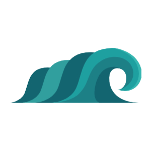

  

  <h1 align="center">WAVE TO GO</h1>

  

    Wave To Go is a surf forecasting website that integrates diverse wave prediction information and map data visualization, solving the problem of surfers needing to understand too much complex information before planning a surf trip.
     
    <a href="https://github.com/Surfer-Alex/wavetogo"><strong>Explore the docs »</strong></a>
     
     
    <a href="https://wavetogo.vercel.app/">View Demo</a>
    ·
    <a href="https://github.com/Surfer-Alex/wavetogo/issues">Report Bug</a>
    ·
    <a href="https://github.com/Surfer-Alex/wavetogo/issues">Request Feature</a>
    

    

  

## Features

- Implemented Taiwan surf spots on a map using React Leaflet and Mapbox API, providing faster filtering of wave forecast information.
- Developed the favorite surf spot collection function that allows quick access to current wave conditions and weekly wave height trends, using Surfline API for prediction data.
- Improved the display of weekly wave forecast trend charts, wind speed, and tide charts on the homepage and surf spot page using React-chartjs. This enhances the understanding of forecasting data.
- Transformed data into user-friendly predictions on wave spot dashboard using data visualization techniques, provided wind maps, equipment recommendations, and tide changes.
- Integrated with Firebase Cloud Firestore to provide real-time wave condition reporting, helping surfers collect more wave information.

## Built with
[![React][React.js]][React-url]

[![Next][Next.js]][Next-url]
[![Tailwind][tailwind]][tailwind-url]
[![Vercel][vercel]][vercel-url]

[![Eslint][eslint]][eslint-url]
[![Prettier][prettier]][prettier-url]

[prettier]:https://img.shields.io/badge/prettier-1A2C34?style=for-the-badge&logo=prettier&logoColor=F7BA3E
[prettier-url]:https://prettier.io/
[eslint]:https://img.shields.io/badge/eslint-3A33D1?style=for-the-badge&logo=eslint&logoColor=white
[eslint-url]:https://eslint.org/
[React.js]: https://img.shields.io/badge/React-20232A?style=for-the-badge&logo=react&logoColor=61DAFB
[React-url]: https://reactjs.org/
[issues-url]: https://github.com/othneildrew/Best-README-Template/issues
[license-shield]: https://img.shields.io/github/license/othneildrew/Best-README-Template.svg?style=for-the-badge
[license-url]: https://github.com/othneildrew/Best-README-Template/blob/master/LICENSE.txt
[linkedin-shield]: https://img.shields.io/badge/-LinkedIn-black.svg?style=for-the-badge&logo=linkedin&colorB=555
[linkedin-url]: https://linkedin.com/in/othneildrew
[Next.js]: https://img.shields.io/badge/next.js-000000?style=for-the-badge&logo=nextdotjs&logoColor=white
[Next-url]: https://nextjs.org/
[tailwind]:https://img.shields.io/badge/Tailwind_CSS-38B2AC?style=for-the-badge&logo=tailwind-css&logoColor=white
[tailwind-url]: https://tailwindcss.com/
[vercel]:https://img.shields.io/badge/Vercel-000000?style=for-the-badge&logo=vercel&logoColor=white
[vercel-url]:https://vercel.com/
